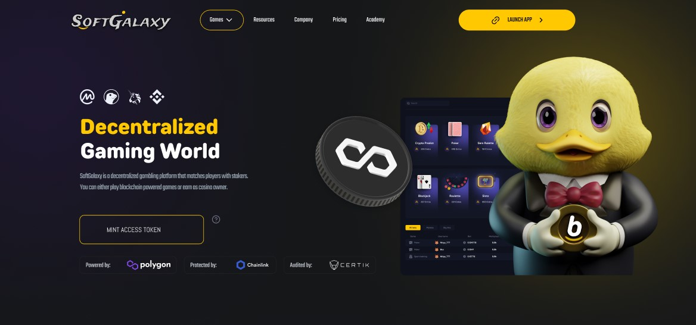
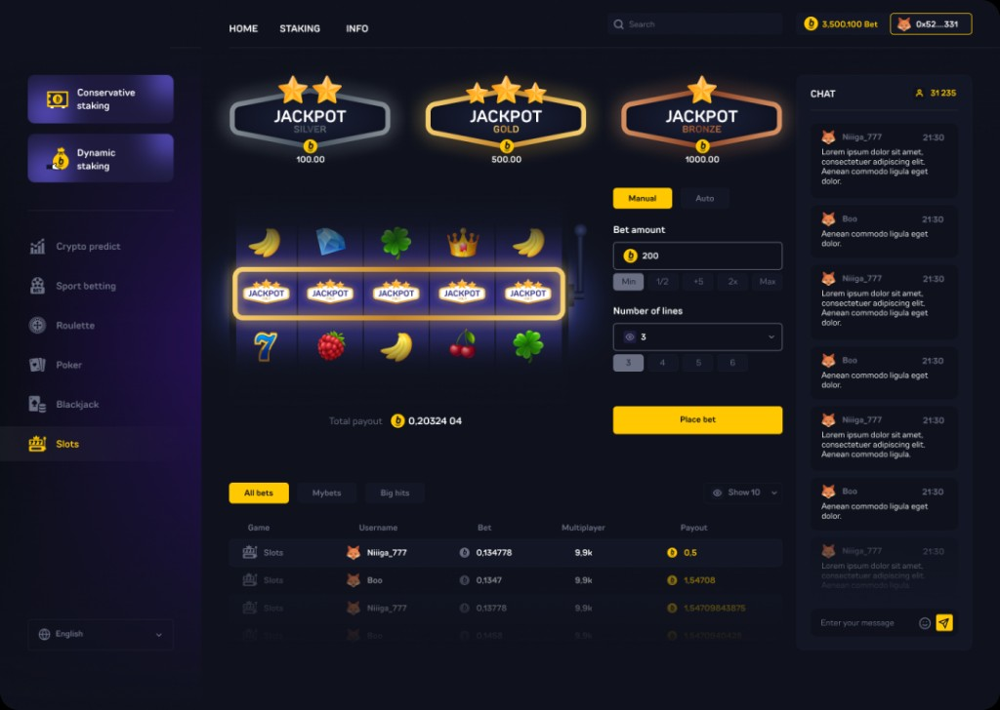
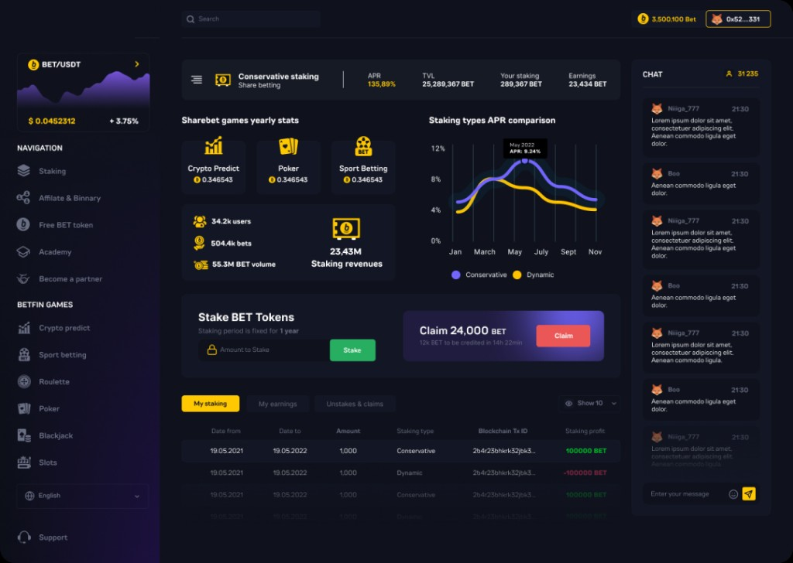
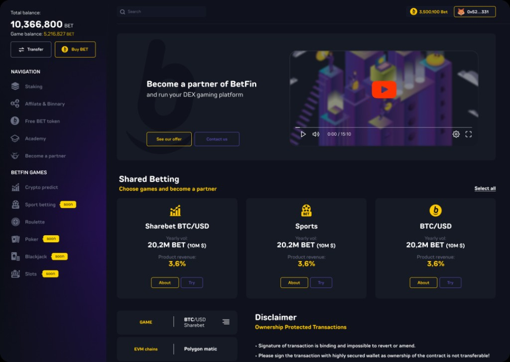

# SoftGalaxyBet


**Decentralized Gaming World** — a Web3 gaming, staking, and affiliate platform powered by the **BET** token.



---

## How it works

SoftGalaxyBet runs on a single value loop:

**Stake → Play → Refer → Claim**

1. **Stake** — Users lock BET into pools that support house liquidity and earn yield.
2. **Play** — In-platform games (roulette, slots, blackjack, prediction) drive engagement and reward flow.
3. **Refer** — A binary + linear affiliate tree pays direct and volume bonuses upline.
4. **Claim** — Staking, gaming, and affiliate earnings settle in one dashboard claim path.

Architecture today: React + Vite frontend with an Express API. Landing and branded flows are in place; full staking, genealogy, and game modules are the product roadmap.

---

| Games | Staking charts | Affiliate network |
|:-----:|:--------------:|:-----------------:|
|  |  |  |

---

## Stack

| Layer | Tech |
|-------|------|
| Frontend | React 18, Vite, React Router, Bootstrap 5 |
| Backend | Node.js, Express |

---

## Getting started


```bash
# 1. Install Backend dependencies
npm install

# 2. Install Frontend dependencies
cd client
npm install
cd ..

# 3. Launch Project
npm start
```

---

Copyright © 2025 SoftGalaxyBet
